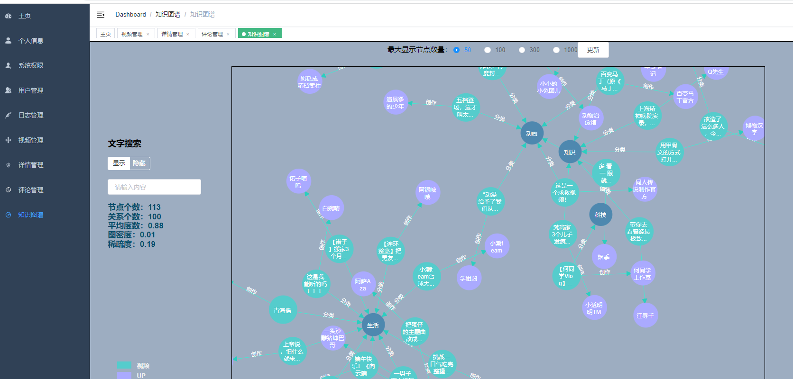
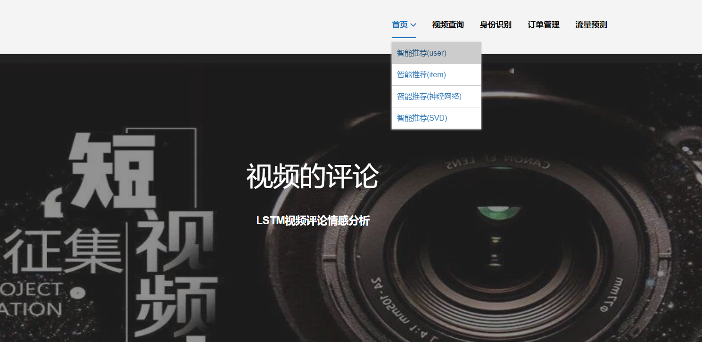

## 计算机毕业设计Python+Spark知识图谱视频推荐系统 短视频推荐系统 视频流量预测系统 短视频爬虫 视频数据分析 视频可视化 视频大数据 大数据毕业设计 大数据毕设

## 要求
### 源码有偿！一套(论文 PPT 源码+sql脚本+教程)

简易

https://www.bilibili.com/video/BV1Lz4y1p7Bt/?spm_id_from=333.999.0.0

详细

https://www.bilibili.com/video/BV1A14y1m7xo/?spm_id_from=333.999.0.0

### 
### 加好友前帮忙start一下，并备注github有偿视频图谱
### 我的QQ号是2827724252或者798059319或者 1679232425或者微信:bysj2023nb

# 

### 加qq好友说明（被部分 网友整得心力交瘁）：
    1.加好友务必按照格式备注
    2.避免浪费各自的时间！
    3.当“客服”不容易，repo 主是体面人，不爆粗，性格好，文明人。

# 开发技术
前端：vue.js、websocket、element-ui、echarts

后端：springboot+mybatis-plus

数据库：mysql、neo4j图数据库(知识图谱)

数据分析：hadoop+spark实时计算

算法：lstm情感分析模型、KNN+CNN卷积神经模型+Kmeans预测、协同过滤算法(基于用户+基于物品全部实现)、MLP深度学习神经网络推荐算法、SVD深度学习神经网络混合CF推荐算法

第三方接口：阿里云短信、百度AI平台、支付宝沙箱支付

爬虫：python实现、chrome driver

# 特色/创新点
知识图谱可视化+知识图谱推荐实现
4种机器学习/深度学习/神经网络推荐算法
用户修改密码通过短信验证码
AI识别身份证号
支付宝沙箱支付
Spark大屏统计
Python爬虫
lstm评论情感分析
前后端分离
...10-20种创新点

# 

# 运行截图

# 运行视频(B站)

简易

https://www.bilibili.com/video/BV1Lz4y1p7Bt/?spm_id_from=333.999.0.0

详细

https://www.bilibili.com/video/BV1A14y1m7xo/?spm_id_from=333.999.0.0

